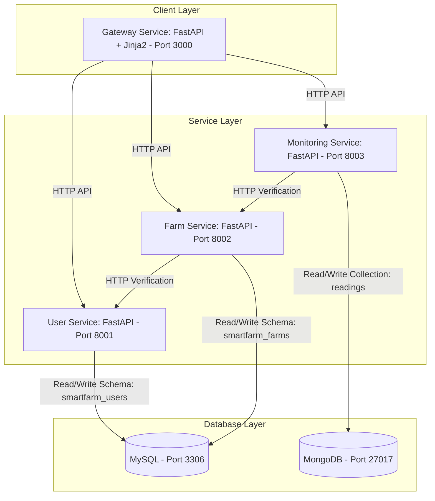

# SmartFarm: End-to-End Microservices Demo Application

**SmartFarm** is a learning-focused, fully containerized **Smart Agriculture Management System**. It is built as a **microservices architecture** using **FastAPI, Docker, Docker Compose, MySQL, MongoDB, and server-rendered Jinja2 templates** — and it ships with a complete **CI/CD pipeline** (GitHub Actions → Docker Hub → AWS EC2) so you can see the *entire* journey from local development to production deployment.

This repository demonstrates how to architect, develop, connect, containerize, test, and deploy independent services — with a real multi-page web UI instead of a single-page JavaScript app.

---

## 1. What This Project Does (Short Introduction)

SmartFarm simulates a farm management platform with three core business domains:

1. **Farmers (Users)** — register and manage farmer profiles.
2. **Farms & Crops** — register land assets and the crops growing on them.
3. **Monitoring** — record sensor readings (soil moisture, temperature, etc.) for each farm.

Each domain is a **separate service** with its **own database**, and a **Gateway service** renders the browser UI by composing data from all three. The whole system runs as 6 Docker containers on a single machine — and the same code is automatically tested, packaged, and deployed to an AWS EC2 server by a CI/CD pipeline.

---

## 2. Technologies Used & Every Term Explained

This is the "what did you actually do here?" section. Every piece of tech and every configuration concept used in this project is explained in plain words.

### Application & Language

| Term | What it is | How we use it here |
|---|---|---|
| **Python** | A general-purpose programming language | All 4 services are written in Python |
| **FastAPI** | A modern Python web framework for building REST APIs (very fast, async) | Every service exposes HTTP endpoints (`/farmers`, `/farms`, `/monitoring`, `/health`) |
| **Uvicorn** | The ASGI web server that actually runs a FastAPI app | Each container starts with `uvicorn app.main:app` |
| **Pydantic** | Data validation library built into FastAPI | Validates request bodies (e.g. a Farmer must have a name + email) |
| **SQLAlchemy** | Python ORM — lets you talk to a SQL database with Python objects instead of raw SQL | Used by user-service and farm-service for MySQL |
| **Jinja2** | Server-side templating engine — renders HTML on the server | Gateway renders the whole UI (dashboard, forms, tables) without a JS framework |
| **Pytest** | Python testing framework | Every service has mocked API tests; CI runs them automatically |

### Architecture & Patterns

| Term | What it is | How we use it here |
|---|---|---|
| **Microservices** | Splitting an application into small, independent services instead of one big monolith | 3 domain services + 1 gateway, each with its own responsibility and database |
| **BFF (Backend-for-Frontend)** | A dedicated service that sits between the browser and the other services, composing data for the UI | The Gateway (port 3000) is the only service the browser talks to |
| **Service-to-Service Communication** | One service calling another over HTTP | Farm Service verifies a farmer exists via User Service; Monitoring verifies a farm via Farm Service |
| **Database-per-Service** | Each service owns its own database/schema — no shared tables | `smartfarm_users` (User), `smartfarm_farms` (Farm), `smartfarm_monitoring` (Monitoring, MongoDB) |
| **REST API** | HTTP endpoints that create/read/update data (GET/POST/PUT/DELETE) | All internal communication is plain HTTP JSON |

### Databases

| Term | What it is | Why we chose it here |
|---|---|---|
| **MySQL** | Popular open-source **relational** SQL database (tables, rows, strict schemas, foreign keys) | Perfect for Farmers/Farms/Crops — structured business data with constraints (unique emails, linked records) |
| **MongoDB** | Popular **NoSQL** document database (flexible JSON-like documents, no fixed schema) | Perfect for sensor readings — different sensors report different fields (moisture, temperature, battery...) |
| **Schema / Collection** | MySQL's table container vs MongoDB's document container | Each service gets its own isolated schema/collection so they never touch each other's data |
| **Seed / Init Script** | A script that runs on first database boot to create the schema | `init-db/init.sql` auto-creates `smartfarm_users` and `smartfarm_farms` on first start |

### Docker & Containerization

| Term | What it is | How we use it here |
|---|---|---|
| **Docker** | Tool to package an app + its runtime into an isolated **container** | Each service + each database runs in its own container |
| **Dockerfile** | A recipe that defines how to build an image (base image → install deps → copy code → start command) | One per service, e.g. `user-service/Dockerfile` starts from `python:3.11-slim` |
| **Image** | A read-only snapshot of the app (the "template") | Built locally or in CI, then pushed to Docker Hub |
| **Container** | A running instance of an image | 6 containers run together: mysql, mongodb, user, farm, monitoring, gateway |
| **Docker Compose** | Tool to define and run a whole multi-container app from one YAML file | `docker-compose.yaml` (local/dev) + `docker-compose.prod.yaml` (EC2) |
| **Volume** | Persistent storage attached to a container so data survives restarts | `mysql_data` and `mongodb_data` keep DB data alive across container restarts |
| **Network (bridge)** | A private virtual network; containers reach each other by service name | Services call `http://user-service:8001` instead of hard-coded IPs |
| **Port Mapping** | Forwarding a container port to the host, e.g. `"3000:3000"` | Gateway is public on 3000; on EC2 the DB/API ports stay internal for security |
| **Healthcheck** | Docker periodically checks if a container is healthy (e.g. curl `/health`) | Every service has one (60s interval); Compose uses them for startup ordering (`depends_on: condition: service_healthy`) |
| **Environment Variables (.env)** | Config passed into containers at runtime (passwords, URLs, DB names) | `.env` is never committed to git; CI generates it on the server from GitHub Secrets |

### CI/CD & Deployment (The DevOps Layer)

| Term | What it is | How we use it here |
|---|---|---|
| **Git** | Version control — tracks every change to the code | All code lives in this repo |
| **GitHub** | Online git hosting + collaboration | Repo is hosted here |
| **GitHub Actions** | GitHub's built-in CI/CD runner — runs automated jobs on triggers (push, PR, manual) | 2 workflows: `ci.yml` (tests) and `cd.yml` (build, push, deploy) |
| **CI (Continuous Integration)** | Automatically test every change as soon as it's pushed | `ci.yml` runs `pytest` for all 4 services on every push/PR |
| **CD (Continuous Delivery/Deployment)** | Automatically package and ship a verified change to a server | `cd.yml` builds images, pushes to Docker Hub, then SSHes into EC2 and starts the app |
| **Docker Hub** | Public registry where Docker images are stored and shared | All 4 images (`smartfarm-user-service`, etc.) are pushed there, tagged `latest` + commit SHA |
| **AWS EC2** | Amazon's cloud virtual server | Production host for the app |
| **SSH / SSH Key** | Secure encrypted way to log into a server | CI/CD uses a private key (`.pem`) to connect to EC2 and run deployment commands |
| **GitHub Secrets** | Encrypted variables stored in the repo settings — never visible in code or logs | Docker Hub credentials, EC2 address/key, MySQL password, etc. |
| **Rollback** | Reverting to an older version | Images are tagged with the commit SHA, so an older image can be pulled manually |

---

## 3. System Architecture

The flow is: **Browser → Gateway (FastAPI + Jinja2 templates) → Microservices (HTTP APIs) → Databases (MySQL & MongoDB)**.



**Key design choice:** the browser only ever talks to the **Gateway Service** (port 3000). The gateway renders pages with **FastAPI + Jinja2 templates** and composes data by calling the three domain services over HTTP — the same boundary the services themselves use. This is a **BFF (Backend-for-Frontend)** style pattern.

---

## 4. CI/CD Pipeline (How It Works)

```
push to master
   │
   ▼
GitHub Actions ── CI ──► run pytest for all 4 services (.github/workflows/ci.yml)
   │
   ▼
GitHub Actions ── CD ──► build 4 images ──► push to Docker Hub
   │                          (smartfarm-<service>:latest + :<commit-sha>)
   ▼
SSH to EC2 ──► docker compose pull ──► docker compose up -d ──► app live on :3000
```

| Workflow | Triggers | What it does |
|---|---|---|
| **CI** (`ci.yml`) | every push / PR to `master` | Runs pytest for user, farm, monitoring and gateway services |
| **CD** (`cd.yml`) | every push to `master` or manual "Run workflow" | Builds 4 images → pushes to Docker Hub → SSHes into EC2 → pulls images → starts containers |

**On the EC2 server, images are never built** — it only pulls ready-made images from Docker Hub using `docker-compose.prod.yaml`. Deploying a new version is as simple as pushing to `master`.

Full step-by-step setup (EC2, secrets, verification): **[docs/deploy.md](docs/deploy.md)**

---

## 5. The Multi-Page UI (Gateway Service)

Every domain service gets its own set of pages (2–4 each), plus a "Command Center" that aggregates everything.

| Page | Route | Service backing it |
|---|---|---|
| Command Center (dashboard) | `/` | all three |
| Farmer Registry (list) | `/farmers` | user-service |
| Register Farmer (form) | `/farmers/new` | user-service |
| Farmer Profile (detail + owned farms) | `/farmers/{id}` | user-service + farm-service |
| Farm & Crop Registry (list) | `/farms` | farm-service |
| Create Farm (form) | `/farms/new` | farm-service |
| Farm Workspace (detail + crop table) | `/farms/{id}` | farm-service + user-service |
| Add Crop (form) | `/farms/{id}/crops/new` | farm-service |
| Field Monitoring (live panel) | `/monitoring?farm_id=N` | monitoring-service |
| Reading History | `/monitoring/history` | monitoring-service |
| Record Sensor Reading (form) | `/monitoring/readings/new` | monitoring-service |

**AJAX usage:** the monitoring page renders fully on the server, but the live panel also refreshes through `GET /ajax/monitoring/{farm_id}` when the farm dropdown changes. All forms are plain HTML POSTs with PRG (Post/Redirect/Get) — no JavaScript required for core workflows.

---

## 6. Running Locally

Prerequisites: **Docker** with **Docker Compose** installed.

```bash
# 1. Create your config from the template
cp .env.example .env        # edit passwords/URLs if needed

# 2. Build & start all 6 containers
docker compose up -d --build

# 3. Watch it come up
docker compose ps
docker compose logs -f gateway-service
```

> Healthchecks run every **60 seconds** — this is intentional (keeps background API traffic low). Compose waits for each dependency to be healthy before starting the next service.

Useful commands:

| Action | Command |
|---|---|
| Stop everything | `docker compose down` |
| Rebuild & start | `docker compose up -d --build` |
| View logs (one service) | `docker compose logs -f user-service` |
| Execute inside a container | `docker exec -it smartfarm_mysql mysql -u root -p` |
| Validate compose file | `docker compose config --quiet` |

---

## 7. Accessing the Application

| What | URL |
|---|---|
| **Web UI (Gateway)** | http://localhost:3000 |
| User Service API docs | http://localhost:8001/docs |
| Farm Service API docs | http://localhost:8002/docs |
| Monitoring Service API docs | http://localhost:8003/docs |
| Gateway health (aggregates all services) | http://localhost:3000/health |
| MySQL server | localhost:3306 (root / your password) |
| MongoDB server | localhost:27017 |

---

## 8. Project Structure

```text
smartfarm/
├── docker-compose.yaml          # Local/dev orchestration (6 containers, builds images)
├── docker-compose.prod.yaml     # Production file for EC2 (pulls images from Docker Hub)
├── .env / .env.example          # Configuration (never commit .env)
├── init-db/init.sql             # Creates isolated MySQL schemas on first boot
├── .github/workflows/
│   ├── ci.yml                   # Runs pytest for all services on push/PR
│   └── cd.yml                   # Build+push to Docker Hub, then deploy to EC2
├── deploy/ec2-setup.sh          # One-time Docker install on the EC2 server
├── gateway-service/             # Browser-facing FastAPI app (port 3000)
├── user-service/                # Farmer profiles (MySQL: smartfarm_users)
├── farm-service/                # Farms & crops (MySQL: smartfarm_farms)
├── monitoring-service/          # Sensor readings (MongoDB)
└── docs/
    ├── learning-guide.md        # From local development to Docker Compose
    ├── demo-scenario.md         # Microservice boundaries + fault tolerance demo
    └── deploy.md                # Full CI/CD deployment guide (EC2 + Docker Hub)
```

---

## 9. Documentation & Next Steps

1. **[docs/learning-guide.md](docs/learning-guide.md)**: Step-by-step tutorial from local development to Docker Compose.
2. **[docs/demo-scenario.md](docs/demo-scenario.md)**: A demo script showing microservices boundaries, service-to-service calls, and fault tolerance.
3. **[docs/deploy.md](docs/deploy.md)**: Deploy to AWS EC2 with the full CI/CD pipeline (GitHub Actions → Docker Hub → EC2).

> Note: the repository's default branch is `master`; the CI/CD workflows trigger on `master`.
